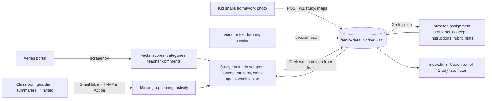

# Plan: Proactive study pipeline (Snap & Tutor, Classroom, study engine)

**Goal:** Stop learning about grades after the fact. Connect what an assignment
actually asks for (the worksheet, the instructions, the rubric) to how the kid
is scoring, so the dashboard can say what to study, hand the kid a guide, and
run a tutoring session on tonight's homework.

**Repos:** `aeries-dashboard` (this repo: scraper, study engine, page) and
`family-data` (Cloudflare Worker + D1: storage, Grok proxy, voice tokens).
The Worker repo is private; Worker changes happen in a local Cursor session
using the endpoint spec below.

**Status:** Planning. Ship in the session order at the bottom.

---

## Principles (carry over from `insights-plan.md`)

1. Python precomputes facts; Grok writes from facts only. Every claim has an
   evidence object.
2. Never log or store student names or numbers beyond the existing
   `student_key`. Photos of homework never appear in logs.
3. Summer/calendar pause still applies. Study generation is a no-op with no
   school in session.
4. Ship in slices; the dashboard stays usable after each one.
5. The kid is a user, not a subject. Study and tutor views are written for
   them; the parent coach view is written for the parent.

---

## What we learned about access (Sept 2026)

| Route | What a parent can get | Verdict |
|-------|----------------------|---------|
| Log into Google Classroom as a parent | Nothing. Google blocks guardians from Stream, Classwork, People, Grades. | Dead end |
| Guardian email summaries | Missing work, upcoming work, class activity. No grades, no content. Teacher or TUSD admin must invite; off by default per class. Edu Standard/Plus adds read-only Classwork preview links (details + attachments). | Worth asking; never received one so far, TUSD uses ParentSquare + Aeries |
| Classroom API from the kid's account | Blocked for under-18 Workspace users unless a TUSD admin allowlists the OAuth app. | Dead end without admin |
| Google Apps Script under the kid's `mytusd.org` account | First-party service, sometimes left on for students. Can read courses, coursework (description, materials, due dates, points), rubrics, submissions, announcements on a nightly trigger. | Test in 10 minutes; best case |
| Kid shares their Drive `Classroom/` folder | Copies of assignment docs and their own work. Needs external sharing allowed. | Test in 10 minutes |
| Bookmarklet on the Classwork page | Whatever is on screen. Works regardless of admin policy; brittle; one click per kid. | Fallback |
| Canvas (if any class uses it) | Real parent Observer role via pairing code, parent app, API with descriptions and rubrics. | Ask the kids which classes use it |
| **Photo of the homework** | The actual page: problems, instructions, rubric, teacher notes. Already what the family does with the Grok app. | **Primary content route** |
| Aeries gradebook | Already scraped: per-assignment `comment` (teacher note) and `documents` (attachment names). Comment is on the page; neither is in the Grok input yet. | Use now |

---

## Data flow (target)



---

## Phase 0: Unblock access (parent, no code)

### 0A. Ask for guardian summaries (low odds, low cost)

Send via ParentSquare to each teacher, or to the school office in one
message. Use the Gmail address that will do the ingestion.

> Hi, I'd like to be added as a guardian in Google Classroom for my student
> so I receive the guardian email summaries (daily if possible). My email is
> ______. If TUSD has guardian preview links turned on, please enable those
> for the class as well. If guardian summaries are not enabled for the
> district, could you point me to who handles Classroom settings? Thank you.

If an invitation arrives, accept it within 120 days from the same address.

### 0B. Fifteen-minute checks with each kid logged in on a family device

Use a laptop or Chromebook signed into the kid's `mytusd.org` account
(confirm the account chip in Chrome). Results go in the table at the end.

**Check 1: Apps Script (best-case route)**

1. Open `https://script.google.com`. A "turned off for your organization" or
   access-blocked page means this route is closed; record "blocked".
2. **New project**. In the left sidebar click **+** next to **Services**,
   pick **Google Classroom API**, **Add**. If it is missing, record
   "no Classroom service".
3. Replace `Code.gs` with:

```javascript
function testClassroom() {
  const res = Classroom.Courses.list({ courseStates: ['ACTIVE'] });
  const courses = res.courses || [];
  Logger.log(courses.length + ' active courses');
  courses.forEach(c => Logger.log('- ' + c.name));
  if (courses.length) {
    const work = Classroom.Courses.CourseWork.list(courses[0].id, { pageSize: 3 });
    const titles = (work.courseWork || []).map(w => w.title);
    Logger.log('Sample coursework in "' + courses[0].name + '": ' + JSON.stringify(titles));
  }
}
```

4. Save, select `testClassroom`, **Run**. On the permission prompt choose
   the school account and **Allow** (if "not verified" appears: **Advanced**,
   then "Go to Untitled project (unsafe)"; it is the kid's own script).
   "Access blocked" / `admin_policy_enforced` means the district blocks the
   Classroom scope; record "scope blocked".
5. Execution log shows a course count, class names, and three assignment
   titles: record "works" and keep the project for the real export script.

**Check 2: Drive `Classroom` folder share**

1. `https://drive.google.com`, **My Drive**, look for a **Classroom** folder
   (exists only if a teacher has used "make a copy for each student").
   None: record "no folder".
2. Right-click it, **Share**, enter the parent Gmail as **Viewer**, **Send**.
   "Sharing outside the organization is not allowed": record "blocked".
   Otherwise open the share notification in the parent Gmail and confirm the
   subfolders are visible: record "works".

**Check 3: Platform per class**

1. `https://classroom.google.com` home shows one card per enrolled class.
   List them and compare with the kid's Aeries period list in the dashboard.
2. Open each card's **Classwork** tab. A class with no dated posts counts as
   "not Classroom" for our purposes.
3. Ask the kid, per remaining class: Canvas, paper, or other.
4. For any Canvas class: kid logs into Canvas, **Account** (left nav),
   **Settings**, right side **Pair with Observer**, copy the six-character
   code (single use, seven days). Parent installs **Canvas Parent**, **Find
   my school** (Tustin Unified), **Create account**, enter the code. Web
   alternative: the Canvas login page, "Parent of a Canvas User? Click Here
   For an Account". Missing or greyed-out pairing button: record "pairing
   disabled" and ask the school. Otherwise open one class and confirm
   assignment descriptions are visible: record "paired".

**Results table**

| Kid | Apps Script | Drive share | Classes in Classroom | Classes in Canvas | Paper / other |
|-----|-------------|-------------|----------------------|-------------------|---------------|
| 1 | works / scope blocked / blocked | works / blocked / no folder | | | |
| 2 | | | | | |

Route selection for Session F: Apps Script export if Check 1 works; Canvas
observer for any Canvas classes; Drive reading if Check 2 works; bookmarklet
only as the fallback. Session B (Snap & Tutor) does not depend on any of it.

### 0C. Snap habit

Nothing to set up. The kids already photograph homework for Grok; Phase 1
gives that photo a home.

---

## Phase 1: Snap & Tutor (primary route)

The kid's existing habit, moved into the dashboard and grounded in their data.

### 1A. Snap flow (page + Worker)

1. Unlocked dashboard, kid picks their name, a class, and an assignment (or
   "not in Aeries yet") and taps **Snap homework**.
2. `<input type="file" accept="image/*" capture="environment">`; the page
   downsizes to at most 1600px on the long edge, JPEG ~0.8, and POSTs to
   `POST /v1/study/snaps`.
3. Worker sends the image to Grok (image understanding, `detail: high`) with
   an extraction prompt and stores the result. Extraction shape:

```json
{
  "snap_id": "snp_…",
  "student_key": "…",
  "class_name": "Integrated Math 1",
  "assignment_ref": {"aeries_number": 14, "title": "Section 3.2 Practice"},
  "captured_at": "2026-09-14T02:10:00Z",
  "extraction": {
    "title_guess": "Section 3.2 Practice: Solving Two-Step Equations",
    "subject": "math",
    "instructions": "Solve each equation. Show your work.",
    "problems": [
      {"n": 1, "text": "3x + 4 = 19", "type": "two_step_equation"},
      {"n": 2, "text": "…", "type": "…"}
    ],
    "concepts": ["two-step equations", "inverse operations", "checking solutions"],
    "rubric_hints": ["show work", "box the answer"],
    "difficulty": "on_level",
    "confidence": 0.86
  }
}
```

The image itself is not kept in D1. Store it in an R2 bucket (`family-study`)
with a 90-day lifecycle rule if we want to re-run extraction later; otherwise
drop it after extraction. Extraction text is what the engine uses.

### 1B. Tutor session

- **Voice (default, matches what the family does today):** the page requests
  an ephemeral token from `POST /v1/study/tutor/token`; the Worker builds the
  session instructions (below) and mints an xAI ephemeral token so the API key
  never reaches the browser. The page opens
  `wss://api.x.ai/v1/realtime?model=grok-voice-latest`, streams mic audio,
  plays replies, and keeps the transcript.
- **Text (quiet room, cheaper):** same instructions through
  `POST /v1/study/tutor/chat`, a Worker proxy to chat completions. Browser
  `SpeechRecognition` / `speechSynthesis` are optional, free add-ons here.
- **End of session:** page POSTs `POST /v1/study/sessions` with a recap the
  model produced from the transcript: `concepts_practiced`,
  `struggled_with`, `got_independently`, `minutes`, `parent_note`.

Session instructions are assembled by the Worker from:

1. The Socratic tutor rules (fixed text, kept in the Worker):
   never give the final answer first; ask what they tried; one step at a
   time; check understanding before moving on; after two stalls, work a
   similar example, not the actual problem; praise specifics; stay on the
   page; age-appropriate; end with a one-line recap for the parent.
2. The snap extraction (problems, concepts, instructions, rubric hints).
3. Aeries context for that class from the latest `grades_latest` payload:
   course, teacher comment on this assignment, category, points, recent
   scores on the same concepts, current weak spots from the study engine.
4. Nothing else. No names beyond first name from the student picker, no
   student number.

### 1C. Cost and guardrails

| Mode | xAI list price (Sept 2026) | 30 min/night, 2 kids, 20 nights |
|------|---------------------------|--------------------------------|
| Voice Agent (speech to speech) | ~$0.08 / min | ~$96 / month |
| Text chat + browser speech | tokens only | a few dollars / month |
| Image extraction | one vision call per snap | cents |

Default the button to text with browser speech; make voice a deliberate
choice with a per-day minute cap enforced in the Worker
(`STUDY_VOICE_MINUTES_PER_DAY`, start at 45). Rate-limit snaps per PIN
token. Reject images over 4 MB after downsizing.

### 1D. Where it lives

- `family-data`: new `study` routes below, `XAI_API_KEY` secret, optional R2
  binding, D1 rows in the existing `docs (app, key, payload, version,
  updated_at)` table with `app = 'study'`.
- `aeries-dashboard/index.html`: Snap button in the class panel and on each
  assignment row; Tutor panel (voice/text toggle, transcript, End session).
- `aeries-dashboard/scraper.py`: reads snaps and session recaps when building
  analytics (Phase 3).

---

## Phase 2: Other content routes (as Phase 0 allows)

- **Aeries now:** put `comment` (teacher note) and `documents` (attachment
  names) into the Grok analytics entries and the study engine. Comment is
  already rendered on the page.
- **Classroom digest (if invited):** `classroom_digest.py` reads labeled
  guardian summaries over IMAP with a Gmail app password (`GMAIL_ADDRESS`,
  `GMAIL_APP_PASSWORD` secrets), parses missing / upcoming / activity with
  links and preview URLs, matches items to Aeries assignments by normalized
  title + due date, and stores `students[].classroom`. Runs inside the
  existing `scrape.yml` steps. No new cron.
- **Apps Script (if allowed):** nightly trigger under the kid's account:
  courses, courseWork, rubrics, studentSubmissions, announcements, plain
  text of attached Docs; POST to `POST /v1/docs/classroom/<student_key>` with
  a per-student write token.
- **Drive share / bookmarklet:** same endpoint, less data.
- **Canvas:** observer pairing, then the Canvas API from the Action with the
  observer token; assignments, descriptions, rubrics, submissions.

Every item carries `source`, `captured_at`, and the original link.

---

## Phase 3: Study engine (Python in scraper, precomputed)

Inputs: Aeries assignments and scores, teacher comments, snap extractions,
tutor session recaps, Classroom or Canvas content when present.

- **Concept tagging** per assignment, cached in `docs` by content hash. From
  extracted or fetched content when available, otherwise from title +
  course + category and flagged `inferred: true`.
- **Mastery table** per class: concept, assignments touching it, points
  earned / possible, tutor sessions where it was `struggled_with` or
  `got_independently`, trend.
- **Weak spots:** low or falling concepts; missing work concentrated in one
  concept; assessment vs practice gap (insights-plan Phase 2);
  `struggled_with` repeating across sessions.
- **Upcoming prep:** for each upcoming assignment or assessment, the
  concepts it likely needs, how the kid did on them, a rubric checklist when
  one was seen.
- **Outputs** under `students[].study`:
  `plan_week` (3 to 5 targeted items with evidence), `guides[]` (concept
  explainer plus 5 to 10 practice problems with answers, kid-readable),
  `materials[]` (curated links by concept from a table in this repo, not web
  search), `parent_notes` (what to ask, what to check), `tutor_starters[]`
  (a suggested first prompt per weak concept so the kid can start a session
  without a photo).
- Grok writes the guide text from these facts only; label anything
  inferred; never invent teacher expectations.
- Published with the rest of the payload to `/v1/grades`; the page reads it
  from `latest`.

---

## Phase 4: Page

- **Parent Coach panel** between the masthead and Classes in
  `renderStudent`: this week's focus with evidence, weak spots, upcoming
  work readiness, last tutor session recap.
- **Kid Study tab** per student, same PIN: plain-language weekly plan, one
  guide per weak concept, practice set with reveal answers, rubric checklist
  for upcoming work, Snap and Tutor buttons. Kid mode hides percentages by
  default with a toggle.
- Class panel rows show teacher comment (already), attachments, Classroom or
  Canvas link, and a snap thumbnail or "snapped" chip when a photo exists.

---

## Phase 5: Hardening

- Fixtures: redacted extraction JSON, digest emails, Classroom exports. Unit
  tests for matching, mastery math, plan selection.
- Privacy: no names or numbers in logs or R2 keys; per-student write tokens;
  PIN unchanged; snaps and sessions readable only behind the PIN token.
- Summer pause covers study generation and tutor token minting.
- Worker: rate limits per PIN token on snaps, chat, and voice minutes.

---

## family-data endpoint spec (build in a local session)

All routes require the existing `Authorization: Bearer <unlock token>`.
Rows live in `docs` with `app = 'study'`.

| Route | Body | Returns | D1 key |
|-------|------|---------|--------|
| `POST /v1/study/snaps` | `{student_key, class_name, assignment_ref?, image_b64}` | `{snap_id, extraction}` | `snap:<student_key>:<snap_id>` |
| `GET /v1/study/snaps?student_key=&since=` | | `{snaps: [...]}` without images | |
| `POST /v1/study/tutor/token` | `{student_key, snap_id? , concept?, mode: "voice"}` | `{client_secret, expires_at, instructions_hash}` | counts toward daily voice minutes |
| `POST /v1/study/tutor/chat` | `{student_key, snap_id?, concept?, messages[]}` | `{reply}` | |
| `POST /v1/study/sessions` | `{student_key, snap_id?, recap}` | `{session_id}` | `session:<student_key>:<session_id>` |
| `GET /v1/study/sessions?student_key=&since=` | | `{sessions: [...]}` | |
| `POST /v1/docs/classroom/<student_key>` | Apps Script / bookmarklet export | `{ok, version}` | `classroom:<student_key>` |

Secrets on the Worker: `XAI_API_KEY`. Vars: `STUDY_VOICE_MINUTES_PER_DAY`,
`STUDY_SNAPS_PER_DAY`. Optional binding: R2 `STUDY_IMAGES`.

The scraper reads `GET /v1/study/snaps` and `GET /v1/study/sessions` for the
last 30 days when building analytics, using the same unlock token it already
uses to publish.

---

## Session split

| Session | Ship |
|---------|------|
| **A** (this repo) | This plan; teacher comments into Grok analytics; Phase 0 drafts |
| **B** (local, family-data) | `study` routes: snaps with extraction, tutor token + chat proxy, sessions |
| **C** (this repo) | Snap button, Tutor panel (text first, then voice), session recap |
| **D** (this repo) | Study engine: concept tagging, mastery, weak spots, weekly plan, guides |
| **E** (this repo) | Coach panel and Study tab |
| **F** (either) | Classroom digest, Apps Script export, or Canvas observer, whichever Phase 0 unlocked |

---

## Open decisions (defaults chosen; change them here)

1. Tutor default mode: text with browser speech; voice on demand with a
   daily cap.
2. Keep homework images: yes in R2 for 90 days, so extraction can be re-run
   when the prompt improves. Set to no if storage of homework photos feels
   wrong.
3. Kid mode hides percentages by default.
4. Materials come from a curated link table, not live web search.
5. Classroom digest transport: IMAP app password in the Action. Alternatives:
   Gmail API OAuth; forwarding to a Cloudflare Email Worker (needs a custom
   domain on Cloudflare).
