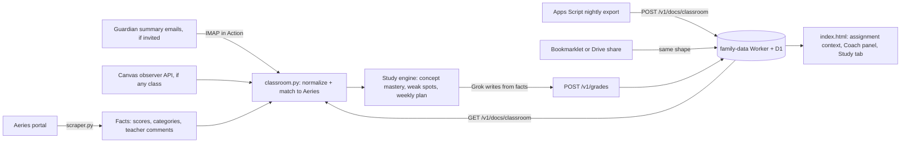

# Plan: Proactive study pipeline (Classroom context first, tutoring later)

**Goal:** Stop learning about grades after the fact. Bring what an assignment
actually asks for (instructions, attachments, rubric, teacher notes) next to
how the kid is scoring, so the dashboard can say what to focus on and hand
the kid a study guide. Tutoring on tonight's homework is a separate track
that plugs into the same data later.

**Repos:** `aeries-dashboard` (this repo: scraper, study engine, page) and
`family-data` (Cloudflare Worker + D1: storage, later Grok proxy). The Worker
repo is private to this agent; Worker changes happen in a local Cursor
session using the endpoint spec below.

**Status:** Planning. Ship in the session order at the bottom.

---

## Principles (carry over from `insights-plan.md`)

1. Python precomputes facts; Grok writes from facts only. Every claim has an
   evidence object.
2. Never log or store student names or numbers beyond the existing
   `student_key`.
3. Summer/calendar pause still applies. Study generation is a no-op with no
   school in session.
4. Ship in slices; the dashboard stays usable after each one.
5. One normalized Classroom shape, whatever the route. Ingestion routes are
   swappable; everything downstream is built once.

---

## What we learned about access (Sept 2026)

| Route | What a parent can get | Verdict |
|-------|----------------------|---------|
| Log into Google Classroom as a parent | Nothing. Google blocks guardians from Stream, Classwork, People, Grades. | Dead end |
| Guardian email summaries | Missing work, upcoming work, class activity. No grades, no content. Teacher or TUSD admin must invite; off by default per class. Edu Standard/Plus adds read-only Classwork preview links (details + attachments). | Worth asking; never received one so far, TUSD uses ParentSquare + Aeries |
| Classroom API from the kid's account | Blocked for under-18 Workspace users unless a TUSD admin allowlists the OAuth app. | Dead end without admin |
| Google Apps Script under the kid's `mytusd.org` account | First-party service, sometimes left on for students. Can read courses, coursework (description, materials, due dates, points), rubrics, submissions, announcements on a nightly trigger. | Test in Phase 0; best case |
| Kid shares their Drive `Classroom/` folder | Copies of assignment docs and their own work. Needs external sharing allowed. | Test in Phase 0 |
| Bookmarklet on the Classwork page | Whatever is on screen. Works regardless of admin policy; brittle; one click per kid. | Fallback |
| Canvas (if any class uses it) | Real parent Observer role via pairing code, parent app, API with descriptions and rubrics. | Ask the kids which classes use it |
| Aeries gradebook | Already scraped: per-assignment `comment` (teacher note) and `documents` (attachment names). Both now go to Grok. | Done |
| Photo of the homework | The actual page. Already what the family does with the Grok app. | Separate tutoring track (Track T) |

---

## Data flow (target)



---

## Phase 0: Unblock access (parent, no code)

### 0A. Ask for guardian summaries (low odds, low cost)

Send via ParentSquare to each teacher, or to the school office in one
message. Use the Gmail address that will do the ingestion.

> Hi, I'd like to be added as a guardian in Google Classroom for my student
> so I receive the guardian email summaries (daily if possible). My email is
> ______. If TUSD has guardian preview links turned on, please enable those
> for the class as well. If guardian summaries are not enabled for the
> district, could you point me to who handles Classroom settings? Thank you.

If an invitation arrives, accept it within 120 days from the same address.

### 0B. Fifteen-minute checks with each kid logged in on a family device

Use a laptop or Chromebook signed into the kid's `mytusd.org` account
(confirm the account chip in Chrome). Results go in the table at the end.

**Check 1: Apps Script (best-case route)**

1. Open `https://script.google.com`. A "turned off for your organization" or
   access-blocked page means this route is closed; record "blocked".
2. **New project**. In the left sidebar click **+** next to **Services**,
   pick **Google Classroom API**, **Add**. If it is missing, record
   "no Classroom service".
3. Replace `Code.gs` with:

```javascript
function testClassroom() {
  const res = Classroom.Courses.list({ courseStates: ['ACTIVE'] });
  const courses = res.courses || [];
  Logger.log(courses.length + ' active courses');
  courses.forEach(c => Logger.log('- ' + c.name));
  if (courses.length) {
    const work = Classroom.Courses.CourseWork.list(courses[0].id, { pageSize: 3 });
    const titles = (work.courseWork || []).map(w => w.title);
    Logger.log('Sample coursework in "' + courses[0].name + '": ' + JSON.stringify(titles));
  }
}
```

4. Save, select `testClassroom`, **Run**. On the permission prompt choose
   the school account and **Allow** (if "not verified" appears: **Advanced**,
   then "Go to Untitled project (unsafe)"; it is the kid's own script).
   "Access blocked" / `admin_policy_enforced` means the district blocks the
   Classroom scope; record "scope blocked".
5. Execution log shows a course count, class names, and three assignment
   titles: record "works" and keep the project for the real export script.

**Check 2: Drive `Classroom` folder share**

1. `https://drive.google.com`, **My Drive**, look for a **Classroom** folder
   (exists only if a teacher has used "make a copy for each student").
   None: record "no folder".
2. Right-click it, **Share**, enter the parent Gmail as **Viewer**, **Send**.
   "Sharing outside the organization is not allowed": record "blocked".
   Otherwise open the share notification in the parent Gmail and confirm the
   subfolders are visible: record "works".

**Check 3: Platform per class**

1. `https://classroom.google.com` home shows one card per enrolled class.
   List them and compare with the kid's Aeries period list in the dashboard.
2. Open each card's **Classwork** tab. A class with no dated posts counts as
   "not Classroom" for our purposes.
3. Ask the kid, per remaining class: Canvas, paper, or other.
4. For any Canvas class: kid logs into Canvas, **Account** (left nav),
   **Settings**, right side **Pair with Observer**, copy the six-character
   code (single use, seven days). Parent installs **Canvas Parent**, **Find
   my school** (Tustin Unified), **Create account**, enter the code. Web
   alternative: the Canvas login page, "Parent of a Canvas User? Click Here
   For an Account". Missing or greyed-out pairing button: record "pairing
   disabled" and ask the school. Otherwise open one class and confirm
   assignment descriptions are visible: record "paired".

**Results table**

| Kid | Apps Script | Drive share | Classes in Classroom | Classes in Canvas | Paper / other |
|-----|-------------|-------------|----------------------|-------------------|---------------|
| 1 | works / scope blocked / blocked | works / blocked / no folder | | | |
| 2 | | | | | |

Route selection for Phase 1C: Apps Script export if Check 1 works; Canvas
observer for any Canvas classes; Drive reading if Check 2 works; bookmarklet
only as the fallback; guardian digest whenever an invitation arrives.

---

## Phase 1: Classroom context (primary)

### 1A. One normalized shape (route-independent, build first)

Every route produces this per student, stored by the Worker under
`docs(app='classroom', key=<student_key>)` or produced directly by the
scraper (digest, Canvas). Missing fields are simply absent.

```json
{
  "source": "classroom_apps_script | classroom_digest | classroom_bookmarklet | classroom_drive | canvas",
  "captured_at": "2026-09-15T05:10:00Z",
  "courses": [
    {
      "id": "1234567890",
      "name": "Integrated Math 1 - P3",
      "section": "Period 3",
      "teacher": "Ms. Example",
      "link": "https://classroom.google.com/c/…",
      "items": [
        {
          "id": "…",
          "type": "assignment | quiz | question | material | announcement",
          "title": "Section 3.2 Practice",
          "description": "Solve each equation. Show your work. Box your answers.",
          "link": "https://classroom.google.com/c/…/a/…/details",
          "topic": "Unit 3: Linear Equations",
          "assigned_at": "2026-09-12T15:02:00Z",
          "updated_at": "2026-09-12T15:02:00Z",
          "due": "2026-09-16T06:59:00Z",
          "max_points": 10,
          "materials": [
            {"kind": "drive | link | youtube | form", "title": "3.2 Worksheet", "url": "…", "text_excerpt": "first ~2000 chars of a Google Doc when readable"}
          ],
          "rubric": {
            "criteria": [
              {"title": "Work shown", "description": "…", "levels": [{"title": "Full", "points": 4, "description": "…"}]}
            ]
          },
          "submission": {
            "state": "NEW | CREATED | TURNED_IN | RETURNED | RECLAIMED_BY_STUDENT",
            "late": false,
            "turned_in_at": null,
            "assigned_grade": null
          }
        }
      ]
    }
  ]
}
```

### 1B. `classroom.py` in this repo (route-independent, build first)

- **Course mapping** to Aeries classes: teacher last name match first, then
  normalized course name tokens; unmatched courses are kept and shown under
  "Other Classroom classes" rather than dropped. A manual override map lives
  in `classroom_map.json` (course id to Aeries period) for the stubborn ones.
- **Item matching** to Aeries assignments: normalized title similarity
  (token set overlap, threshold ~0.6) plus due date within 3 days. Produces
  three sets per class: `matched`, `classroom_only` (posted in Classroom,
  not yet in Aeries: the earliest possible warning), `aeries_only`.
- **Signals**:
  - `turned_in_aeries_missing`: Classroom says TURNED_IN, Aeries still flags
    missing (grading lag; the story is "portal still shows", not "never
    did").
  - `not_started_due_soon`: NEW/CREATED, due within 2 days.
  - `late_turn_in`: `late: true`.
  - `posted_this_week`: new items since last capture.
- **Analytics merge**: each Aeries assignment entry gains
  `classroom: {link, instructions_excerpt, materials_count, rubric_summary,
  submission_state}` when matched; each class gains
  `classroom: {course_link, classroom_only[], recent_announcements[],
  signals[]}`. Tonight/upcoming can include `classroom_only` items labeled
  `source: classroom`.
- **Grok prompt additions**: may say what an assignment asks for using
  `instructions_excerpt` and `rubric_summary`; may explain a missing item
  with `submission_state`; never invent instructions when the field is
  absent.
- **Tests** with fixtures: a redacted normalized JSON per route, matching
  edge cases (renamed titles, shifted due dates, two sections of one
  course), signal derivation.
- Runs inside the existing `scrape.yml` steps. No new cron.

### 1C. Ingestion routes (pick by Phase 0 results)

**Apps Script export (preferred).** `tools/classroom_export.gs` in this
repo, pasted once into the kid's project from Check 1. Nightly time trigger
(~9pm PT so the overnight scrape picks it up). Reads `Courses.list`,
`CourseWork.list`, `CourseWorkMaterials.list`, `Announcements.list`,
`StudentSubmissions.list` (`userId: 'me'`), `Rubrics.list` where available;
exports plain text of attached Google Docs via the Drive service (first
~2000 chars); skips PDFs and Forms. POSTs the normalized JSON to
`POST /v1/docs/classroom/<student_key>` with a per-student write token kept
in Script Properties. Never includes the kid's name or number; the Worker
knows them by token.

**Guardian digest (if invited).** `classroom_digest.py` reads labeled
summaries over IMAP with a Gmail app password (`GMAIL_ADDRESS`,
`GMAIL_APP_PASSWORD` secrets), parses missing / upcoming / activity with
links (and preview URLs on Edu Plus), and emits the same shape with
`type` and `title`, `due`, `link` only. Fixtures from real (redacted) emails
before writing the parser.

**Canvas observer (per Canvas class).** Observer API token from the parent
account (if the institution allows tokens), `GET /api/v1/users/self/observees`,
then courses, assignments (description, rubric), submissions. Emits the
same shape with `source: canvas`.

**Bookmarklet / Drive share (fallbacks).** Bookmarklet serializes the
Classwork page into the shape and POSTs to the same endpoint. Drive share
gives document text only; used to fill `materials[].text_excerpt`.

### 1D. Page

- Assignment row expands to show Classroom instructions excerpt, attachment
  names with links, rubric criteria, submission state, and a link to open it
  in Classroom.
- Class panel gets a "Posted in Classroom, not in Aeries yet" list and a
  "Turned in, awaiting Aeries" chip where the signal fires.
- Masthead chip when `not_started_due_soon` fires for any class.

### 1E. Worker (local session, small)

| Route | Auth | Body | Returns | D1 |
|-------|------|------|---------|----|
| `POST /v1/docs/classroom/<student_key>` | `X-Student-Token` (per-student secret) | normalized JSON | `{ok, version}` | `docs(app='classroom', key=<student_key>)` |
| `GET /v1/docs/classroom/<student_key>` | existing PIN unlock token | | latest payload | |

Vars: `CLASSROOM_TOKENS` (JSON map token to student_key). Size limit 1 MB.
Reject payloads containing a `name` field at the top level as a guard.

---

## Phase 2: Study engine (Python in scraper, precomputed)

Inputs: Aeries assignments and scores, teacher comments, Classroom or
Canvas items (instructions, materials text, rubrics), later tutor recaps.

- **Concept tagging** per assignment, cached in `docs` by content hash. From
  instructions and material text when available, otherwise from title +
  course + category and flagged `inferred: true`.
- **Mastery table** per class: concept, assignments touching it, points
  earned / possible, trend.
- **Weak spots:** low or falling concepts; missing work concentrated in one
  concept; assessment vs practice gap (insights-plan Phase 2).
- **Upcoming prep:** for each upcoming assignment or assessment, what it
  asks for (from Classroom), the concepts it needs, how the kid did on them,
  the rubric as a checklist.
- **Outputs** under `students[].study`: `plan_week` (3 to 5 targeted items
  with evidence), `guides[]` (concept explainer plus 5 to 10 practice
  problems with answers, kid-readable), `materials[]` (teacher-posted
  materials first, then a curated link table in this repo), `parent_notes`.
- Grok writes the guide text from these facts only; label anything
  inferred; never invent teacher expectations.
- Published with the rest of the payload to `/v1/grades`.

---

## Phase 3: Coach panel and Study tab

- **Parent Coach panel** between the masthead and Classes in
  `renderStudent`: this week's focus with evidence, weak spots, upcoming
  work readiness.
- **Kid Study tab** per student, same PIN: plain-language weekly plan, one
  guide per weak concept, practice set with reveal answers, rubric checklist
  for upcoming work. Kid mode hides percentages by default with a toggle.

---

## Phase 4: Hardening

- Fixtures: redacted normalized Classroom JSON per route, digest emails.
  Unit tests for mapping, matching, signals, mastery math, plan selection.
- Privacy: no names or numbers in logs, payloads, or D1 keys beyond
  `student_key`; per-student write tokens; PIN unchanged.
- Summer pause covers study generation.

---

## Track T: Snap & Tutor (separate development, after Phase 1)

The family's current habit (photo of the homework into Grok voice), moved
into the dashboard and grounded in the kid's data. Independent of the
Classroom routes; plugs into the study engine when built.

- **Snap:** kid taps Snap homework, the page downsizes the photo and POSTs
  to `POST /v1/study/snaps`; the Worker runs Grok image understanding and
  stores an extraction (title guess, instructions, problems, concepts,
  rubric hints, confidence). Image kept in R2 for 90 days or dropped.
- **Tutor:** text by default (Worker proxy `POST /v1/study/tutor/chat`,
  browser speech optional); voice on demand through xAI's realtime Voice
  Agent API with an ephemeral token from `POST /v1/study/tutor/token`, so
  the API key never reaches the browser. Fixed Socratic rules: never the
  final answer first; ask what they tried; one step at a time; after two
  stalls, a similar example, not the actual problem; end with a one-line
  recap for the parent.
- **Grounding:** snap extraction + Aeries context (course, teacher comment,
  recent scores on the same concepts, weak spots) + Classroom instructions
  and rubric when Phase 1 has them.
- **Recap:** `POST /v1/study/sessions` with `concepts_practiced`,
  `struggled_with`, `got_independently`, `minutes`, `parent_note`; feeds the
  mastery table.
- **Cost:** voice ~$0.08/min (about $96/month at 30 min/night for two
  kids); text is a few dollars/month. Daily voice cap in the Worker
  (`STUDY_VOICE_MINUTES_PER_DAY`), snap cap (`STUDY_SNAPS_PER_DAY`).
- **Worker routes:** `POST/GET /v1/study/snaps`, `POST /v1/study/tutor/token`,
  `POST /v1/study/tutor/chat`, `POST/GET /v1/study/sessions`; secret
  `XAI_API_KEY`; optional R2 binding `STUDY_IMAGES`.

---

## Session split

| Session | Ship |
|---------|------|
| **A** (this repo, done) | This plan; teacher comments into Grok analytics; Phase 0 instructions |
| **B** (this repo, no dependency on Phase 0) | `classroom.py`: normalized shape, course mapping, item matching, signals, analytics merge, Grok prompt additions, fixtures + tests; `tools/classroom_export.gs` ready to paste |
| **C** (local, family-data) | `POST/GET /v1/docs/classroom/<student_key>` with per-student tokens |
| **D** (this repo) | Assignment row context, class panel Classroom lists, masthead chip |
| **E** (this repo, after Phase 0 results) | Whichever route: Apps Script trigger live, or digest parser, or Canvas observer, or bookmarklet |
| **F** (this repo) | Study engine |
| **G** (this repo) | Coach panel and Study tab |
| **T1, T2** (family-data, then this repo) | Snap & Tutor when wanted |

---

## Open decisions (defaults chosen; change them here)

1. Matching threshold and due-date window: 0.6 token overlap, 3 days.
   Tune against real data in Session E.
2. Unmatched Classroom courses are shown, not hidden.
3. Kid mode hides percentages by default.
4. Materials: teacher-posted first, then a curated link table; no live web
   search.
5. Digest transport: IMAP app password in the Action. Alternatives: Gmail
   API OAuth; forwarding to a Cloudflare Email Worker (needs a custom domain
   on Cloudflare).
6. Track T image retention: R2 for 90 days by default; set to none if
   storing homework photos feels wrong.
